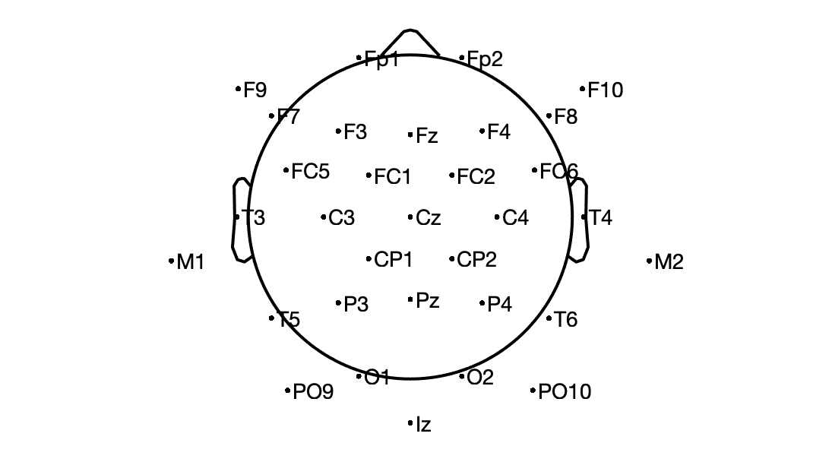

# Optimize montage
 
This program uses EEGLAB to create a montage where electrodes are as far from each other as possible. For 
source localization, it is ideal to have a good head coverage.
 
The program uses electrode in the 10-5 notation but could use other
type of template montage.
 
# Dependencies
 
This program requires MATLAB and [EEGLAB](https://eeglab.org/) to be installed.
 
# Usage
 
Edit the file optimize_montage.m and change parameters.
The parameters are as follow:
- montage: 'besa' (spherical head model) or 'BEM' (realistic coordinates). 'besa' is preferable because positions are defined mathematically.
- nchan: number of channels in the final montage
- includeChans: list of channels to include in the montage. Sometimes you might want to include specific channels in your montage.
- ignoreChans: list of channels to ignore (because not practical for some reasons)
- ignore10_5: when true, ignore most 10_5 specific channel (those postfixed with "h"), only consider 10-10 channels
- replaceChans: provide list of channels to replace at the end, one per row replaceChans = { 'CP6' 'FC6'; 'CP5' 'FC5' }
 
# Example

This figure is obtained using the default values in optimize_montage.m

